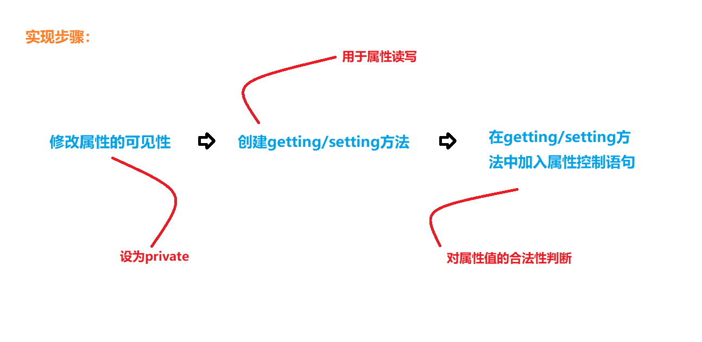

# Java 封装
## 封装的需求
- 程序设计在追求“高内聚，低耦合”的特点
  - 所谓“高内聚”，即是封装代码细节，提高可维护性
  - 所谓“低耦合”，即是简化外部调用，便于使用者使用
- 这样一来，提高了代码的安全性和复用性
## 概念
- 将类的某些信息隐藏在类内部，不允许外部程序直接访问，而是通过该类提供的方法来**实现对隐藏信息的操作和访问**

## 封装的好处
- a.只能通过规定的方法访问数据
- b.隐藏类的实例细节，方便修改和实现
- c.适当的封装，可以将对象使用接口的程序实现部分隐藏起来，不让用户看到，同时确保用户无法任意更改对象内部的重要资料，增强代码安全性



## Java的访问修饰符
- java的访问修饰符包括`private`、`default`、`protected`、`public`
  | 访问修饰符 | 本类  |  同包   |  子类  |  所有类| 
  | :-------:| :-------:| :-------:| :-------:| :-------:|
  |private| √||||
  |default|√|√|||
  |protected|√|√|√||
  |public|√|√|√|√|
- 对属性一律`private`私有化
- 普通类使用`public`


## This关键字
>This 也被成为创建好对象的地址,但不可用于静态方法
- 使用语法：
  ```java
  public class TextThis{
     int a,b,c;
     TextThis(int a,int b){
        this.a=a;
        this.b=b;
     }
  } 
  ```
  - `this.`属性名，表示操作当前对象的属性
  - `this.`方法，表示调用当前对象的方法
  - 我们在封装对象的属性时，经常会用到`this`关键字