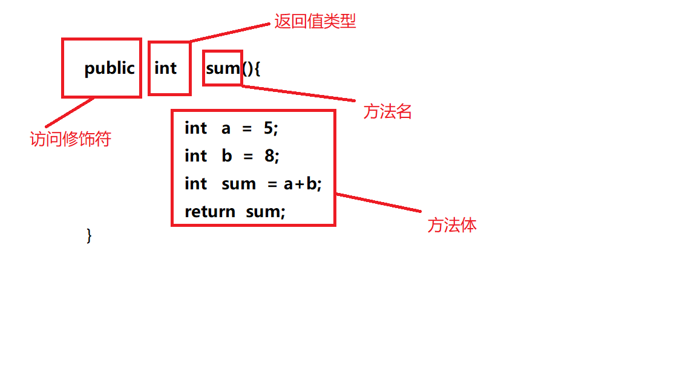

# Java方法
## 概述
- 语法：
  访问修饰符 返回值类型 方法名(参数列表){
      方法体
  }
- **访问修饰符：**方法运行被访问的权限范围，通常可以设置为`public`,`protected`,`private`,甚至可以省略
- **返回值类型：**方法返回值的类型，如果方法不返回任何值，则返回值类型指定为`void`;如果方法具有返回值，则需要指定返回值类型，并且在方法体中使用`return`语句返回值
- **方法名：**定义方法的名字，必须使用合法的标识符
- **参数列表：**可以有多个，多个参数之间用逗号隔开，每个参数由参数类型和参数名组成，此时方法分成四类
  - **无参无返回值的方法**
  - **无参有返回值的方法**
  - **有参无返回值的方法**
  - **有参有返回值的方法**

### 1.1 无参无返回值方法的使用
- 第一步：定义方法（即概述中的语法）
- 第二步：调用方法
  - 先创建类的对象，再通过对象名`.`方法名`(``)`;实现
  - 例如：
    ```java
    public class Person{
        Person teacher = new Person();
        public void teach{
            System.out.println("teaching.....");
        }
        teacher.teach();
    } 
    ```

### 1.2 无参有返回值方法的使用
- 例如：
  

- 重点：
  - 1. 如果方法的返回类型为`void`，则方法中不能使用`return`返回
  - 2. 方法的返回值最多只能有一个，不能返回多个值
  - 3. 方法返回值的类型必须兼容

### 1.3 有参无返回值方法的使用
- 语法：
  - 对象名`.`方法名`(`实参1,实参2,....`)`

- **注意**
  - 调用带参方法时，必须保证实参的数量，类型，数据顺序与形参一一对应
  - 调用方法时，实参不需要知道数据类型
  - 方法的参数可以是基本类型，也可以是引用类型（即String，数组）
  - 当方法参数有多个时，使用逗号分隔

## 方法的重载
- **概念理解：**如果同一个类包含了两个或两个以上方法名相同，方法参数的个数、顺序或类型不同的方法
  - 判断依据
    1. 必须是在同一个类中
    2. 方法名相同
    3. 方法参数的个数、顺序或类型不同
    4. 与方法的修饰符或返回值没有关系 
