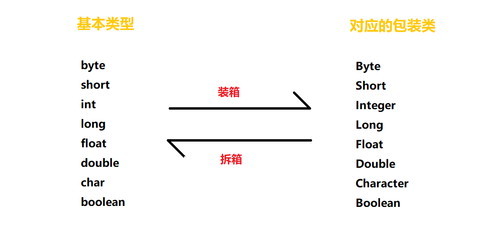
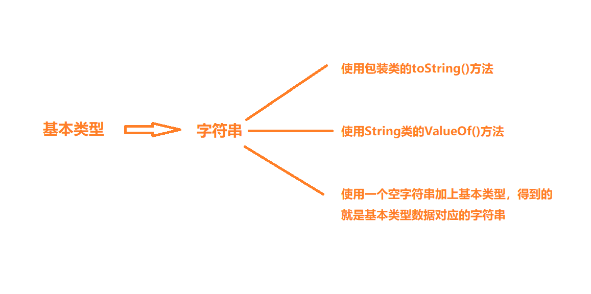
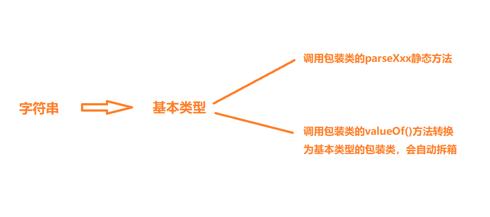

# Java的一些类
## StringBuilder和StringBuffer的使用
- 这两个方法的基本解释：
  - `StringBuilder`:线程不安全，效率高
  - `StringBuffer`:线程安全，效率低

- 实例：
  ```java
  StringBuilder s = new StringBuilder();//初始长度为16
  StringBuider s1 = new StringBuilder(32);//初始length=32 
  s.append();
  s.delete(int start,int end);
  ```
## StringBuilder类的常用方法
| 类名 | 方法名  | 解释 |
|:----:|:------:|:----:|
|StringBuilder|append(参数)|追加内容到当前`StringBuilder`对象的末尾|
|StringBuilder|insert(位置，参数)|将内容插入到`StringBuilder`对象的指定位置|
|String|toString()|将`StringBuilder`对象转换为`String`对象|
|int | length()|获取字符串长度|

## 字符串

### 一、子串
- 通过`String`类中的`substring`方法从一个字符串中提取一个子串
- 例如：
  ```java
  String s = "Hello";
  String t = s.substring(0,3);//substring方法用来计算子串的长度，（0，3）表示要复制从0-3的字符，即H、e、l
  ```
### 二、拼接
- 通过使用`+`实现
- 常用方法：
    ```java
    String player = "vango";
    String project = "sunflower";
    String message = player + project;
    ```
- 字符串与一个非字符串的值进行拼接，后者变成字符串
- 可以与输出语句一起使用：
  - ```System.out.println("result:"+answer);```
- 多个字符串放在一起，使用`join`静态方法
  ```java
  String all = String.join("/","S","M","L");
  //打印结果： all = “S/M/L”;
  ```

### 三、不可变字符串
- `String`类没有通过修改字符串的方法，修改方法为：提取加拼接
  - 例如：
  ```java
  String s = "Hello";
  s = s.substring(0,3)+"p!";
  //  此时 s= help!
  ```

### 四、检查字符串是否相等
- 方法：`s.equals(t)`
  - s和t都为字符串，该方法的逻辑是：若s=t ,则输出`true`，否则，输出`false`
  - s可为值，也可以为名称

### 五、空串和NUll串
- 空串就是长度为0的字符串,占用内存
- null是空引用，表示一个对象的值，没有分配内存，调用null的字符串的方法会抛出空指针异常。
- 空串的表示:
  ```java
  if(str.length()== 0 ){

  } 
  //或者
  if(str.equals("")){

  }
  ```
- null串表示：
  ```java
  if(str == null){

  } 
  ```
- 既不是空串，也不是null：
  ```java
  if(str != null &&str.length()){

  } 
  ```

### 六、注意的点
- 字符串`str`中字符的索引从0开始，范围从0到`str.length()`-1
- 使用`indexOf`进行字符或字符串查找时，如果匹配返回位置索引，如果没有匹配结果，返回-1
- 使用`substring(beginIndex,endIndex)`进行字符串提取时，包括`beginIndex`位置的字符，不包括`endIndex`位置的字符

## 重写与重载（@Override和@Overload）
- 重写———存在于继承体系中，子类实现父类方法声明的一致相同方法
  - 访问权限：子类方法`>=`父类方法
  - 返回类型：之类方法的返回类型为父类方法返回类型或子类型
- 重载———存在于同一个类，方法存在且方法名相同，但参数类型、个数、顺序至少一个不同
  - 只有返回值不同的,不叫重载!!!

## Java包装类（Wrapper Class）
- 包装类就是讲基本类型数据转化为对象，即八种基本类型对应八种包装类
  

- **自动装箱与自动拆箱**
  - **自动装箱（auto-boxing）**
    - 基本类型自动封装到它相同的包装类里
      ```java
      Integer i = 100;
      //本质上，编译器编译时为我们提供了以下代码：
      Integer i = nwe Integer(100);
      ```
  - **自动拆箱（unboxing）**
    - 包装类对象自动转换为基本类型
      ```java
      int a = new Integer(100);
      //本质上：
      int a = new integer(100).intValue();
      ```
  - 特别的：
    ```java
    Integer d1 = -129;
    Integer d2 = -129;
    System.out.println(d1==d2);
    //输出的是false，因为在[-128,127]之间的数，按照基本类型处理

## Java中基本类型和字符串之间的转换
- 基本类型转字符串
  
- 实例：
  ```java
  int c = 10;
  String str1 = Integer.toString(c);
  String str2 = String.valueOf(c);
  String str3 = c+ " ";
  ```
- 字符串转基本类型
  
- 实例：
  ```java
  String str = "8";
  int d = Integer.parseInt(str);
  int e = Integer.valueOf(str);
  ```     
