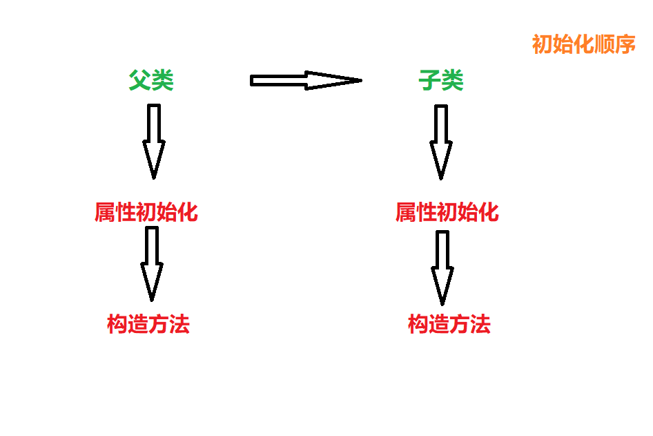

# Java 继承
## 关于继承
### 概念
- 继承是类与类的一种关系，是一种“is a”的关系
- 继承可以使得子类具有父类别的各种属性和方法，而**不需要再次编写相同的代码**。在令子类别继承父类别的同时，可以重新定义某些属性，并重写某些方法，即覆盖父类别的原有属性和方法，使其获得与父类别不同的功能。

### 继承的特性
- Java只有单继承，即只有一个父类
- 没有调用`extend`，则父类为`java.lang`
- 使用`instance of`判断对象类型

### 超类、子类
- 对于java中继承的某些知识，在这里需要给读者插补一点类的基本知识，让文章更具有可读性

#### 超类
- 超类，也称父类，Java只允许一个class继承自一个类，因此，一个类有且仅有一个父类。只有`Object`类特殊，它没有父类，所有它是所有类的父类。

#### 子类
- 子类就是继承父类的所有方法，在此基础上在实现子类自己的一些方法

### 继承的优点
1. 子类拥有父类的属性和方法
2. 实现代码复用

### 使用语法
```java
Class Student extends Person{

}//student就是子类，Person就是父类
```
### 继承的初始化顺序
- 初始化父类在初始化子类
- 先执行初始化对象中的属性，再执行构造方法中的初始化
- 

## 方法的重写(override)
### 概念
- 如果子类对继承父类的方法不满意，是可以重写父类继承的方法的，当调用方法时会优先调用子类的方法
- 使用规则：
  - `@override`的注释下的方法即为重写的方法，其本质是覆盖父类的方法

### 语法规则
- **返回值类型、方法名、参数类型与个数这三者必须与父类继承的方法相同，这样才叫做方法的重写**
- **子类访问权限大于父类访问权限**

## final关键字
- `final`,即“最终的”
- `final`可以修饰类、方法、属性和变量
  - `final`修饰类，则该类**不允许被继承**
  - `final`修饰方法，则该方法**不允许被覆盖（重写）**
  - `final`修饰属性，则该类的属性不会进行隐式的初始化（类的初始化属性必须有值）或在构造方法中赋值
  - `final`修饰变量，则该变量的值**只能赋一次值**，即为常量

## Super关键字
### 概念
- `super`关键字是指示编译器调用超类方法的特殊关键字
- 直接父类对象的引用，通过`super`来访问父类中被子类覆盖的方法或属性
- 在对象内部使用，可以代表父类对象

### 使用语法
- 对父类属性的访问
  ```java
  super.age;//age是父类的一个属性
  ```
- 对父类方法的访问
  ```java
  super.eat();
  ```
- 调用父类`toString`方法
  ```java
  super.toString();//默认父类为object类
  //输出格式为：全路径@全限定名Hashcode
  ``` 
- **特殊使用法！！！**
  ```java
  super(变量1，变量2)
  ```
  - 这样使用会使父类的私有域进行初始化，也称调用超类的构造器  

### super应用
- 子类在构造过程中必须调用其父类的构造方法
- 如果子类的构造方法中没有显示调用父类的构造方法，则系统默认调用父类无参的构造方法
- 如果显示的调用构造方法，必须在子类的构造方法的**第一行**
- 如果子类构造方法中既没有显式调用父类的构造方法，二父类又没有无参的构造方法，则编译出错

## Object类
### 概念
- `Object`类是所有类的父类，如果一个类没有使用`extends`关键字来明确标识继承另一个类，那么这个类默认继承`object`类

## 方法
1. `toString()`方法
   - 在`Object`类中定义`toString()`方法的时候放的对象时哈希码（即对象地址字符串）
2. `equals()`方法
   - 比较的是对象的引用是否执行同一块内存地址
   - 一般情况下比较两个对象时比较它的值是否一致，所有要进行重写`@Override` 

  