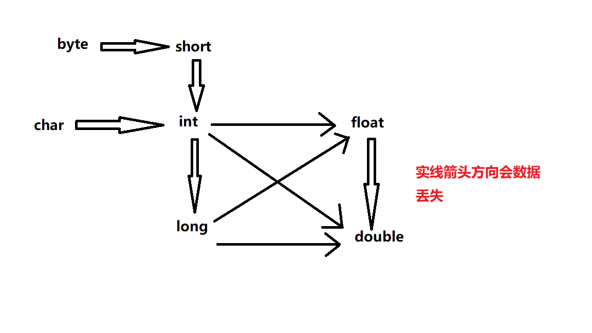

# 初识java
## 1.Java是一门什么语言？Java的怎样诞生的？      

- **Java** &nbsp;是一种广泛使用的计算机编程语言，拥有跨平台、面向对象、泛型编程的特性，广泛应用于企业级Web应用开发和移动应用开发。
- 任职于Sun微系统的詹姆斯·高斯林等人于1990年代初开发Java语言的雏形，最初被命名为Oak，目标设置在家用电器等小型系统的编程语言，应用在电视机、电话、闹钟、烤面包机等家用电器的控制和通信。
- Sun微系统对Java语言的解释是：“Java编程语言是个简单、面向对象、分布式、解释性、健壮、安全与系统无关、可移植、高性能、多线程和动态的语言”。 ——摘自维基百科

## 2.语言特性
- Java之所以被开发，是要达到以下五个目的：
  - 应当使用面向对象程序设计方法学
  - 应当允许同一程序在不同的计算机平台执行
  - 应当包括内建的对计算机网络的支持
  - 应当被设计成安全地执行远端代码
  - 应当易于使用，并借鉴以前那些面向对象语言（如C++）的长处。

### 2.1 面向对象

- **Java** &nbsp;的特点之一就是面向对象，是程序设计方法的一种。“面向对象程序设计语言”的核心之一就是开发者在设计软件的时候可以使用自定义的类型和关联操作。代码和数据的实际集合体叫做“对象”。
  - 一个对象可以想象成绑定了很多“行为（代码）”和“状态（数据）”的物体。对于数据结构的改变需要和代码进行通信然后操作，反之亦然。面向对象设计让大型软件工程的计划和设计变得更容易管理，能增强工程的健康度，减少失败工程的数量。

### 2.2 跨平台性

- **跨平台性** &nbsp;是Java主要的特性之一，跨平台使得用Java语言编写的程序可以在编译后不用经过任何更改，就能在任何硬件设备条件下运行。这个特性经常被称为“一次编译，到处运行”。


### 2.3 自动垃圾回收机制（Garbage Collection）

- **自动垃圾回收** &nbsp;是查看堆内存，识别正在使用的对象和未使用的对象以及删除未使用的对象的过程。使用中的对象或引用的对象意味着程序的某些部分仍维护着指向该对象的指针。程序的任何部分都不再引用未使用的对象或未引用的对象。因此，可以回收未引用对象使用的内存。

---
## Java准则
- 1. 所有的标点符号必须是因为字符
- 2. JAVA**区分大小写**
- 3. 创建```.java```文件时，文件名和类名相同
- 4. 变量：
  - **成员变量** —— 所有方法都适用
  - **局部变量** —— 局部变量与成员变量重名时，成员变量暂时失效
- 5. java程序中的```main```方法
  - 必须为```public static void```
  - ```main```方法为程序入口

- 6. 基本数据类型
  
     | 整型 | 浮点型 | 字符型 | 布尔型 |
     |:-----:|:-------:|:--------:|:--------:|
      |```int```,```long```,```byte```,```short```|```float```,```double```|```char```|```boolean```|
  - 使用```long```类型时末尾应加上“L”，否则默认为```int```型
  - 使用`float`时末尾应加上“f”，否则默认为`double`型
  - 八进制必须以`0`开头，十六进制必须以`0x`开头

- 7. 运算符
  - 赋值运算符&nbsp;&nbsp;&nbsp;`=`
  - 算术运算符&nbsp;&nbsp;&nbsp;`+`,`-`,`*`,`/`
  - 自增、自减运算符&nbsp;&nbsp;&nbsp;`++`,`--`(进行运算的必须是一个整型或者浮点型)
  - 比较运算符&nbsp;&nbsp;&nbsp;`>`,`<`,`==`,`>=`,`<=`,`!=`
  - 逻辑运算符&nbsp;&nbsp;&nbsp;`&&`(与运算),`||`(或运算)，`!`(非运算)
  - 条件运算符&nbsp;&nbsp;&nbsp;（条件式 ？ 值1 ：值2）
    - 例如：
      ```java
      int y=a>b? x+1:x-1;
      //如果a>b成立，y=x+1,否则y=x-1
      ```
- 8. 数据类型转换
  - 自动类型转换
  - 强制类型转换
      

  - 关于自动类型转换：数字表示范围小的数据类型可以自动转换我范围大的数据类型
  - **自动转换的溢出问题**
    - 例如：
      ```java
      int count =1000000000;
      int price =1999;
      long total = count * price; 
      //输出结果为负数，原因是两个int相乘结果为int，相乘结果超过了int类型的范围，把count变成long类型即可（该操作称为类型提升）
  - 强制类型转换实例：
    - 例1：
      ```java
      short a =199;
      int i = a; //i=199
      ```
    - 例2：
      ```java
      double d =10.24;
      long flag = (long)d;//flag =10
      ``` 

