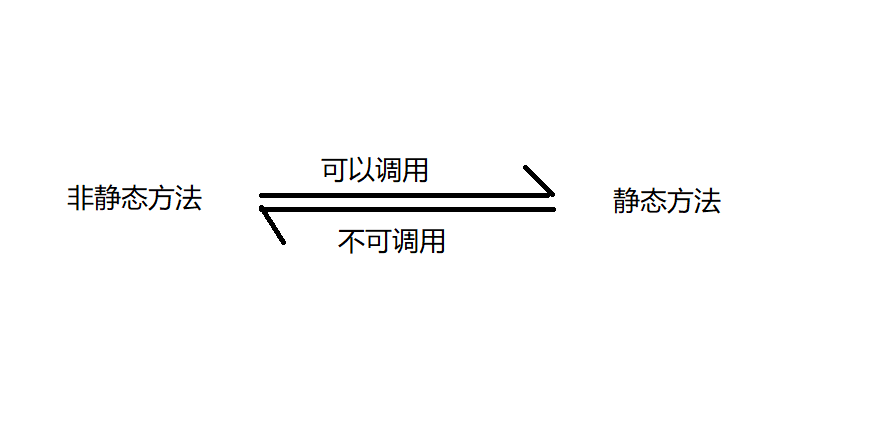

# 类和对象
## 什么是类？
- **类（class）**在面向对象编程中是一种面向对象计算机编程语言的构造，是创建对象的蓝图，描述了所创建的对象共同的属性和方法。
- 类有接口和结构。接口描述了如何通过方法与类及其实例互操作，而结构描述了一个实例中数据如何划分为多个属性。
- 类是与某个层[注 1]的对象的最具体的类型。类还可以有运行时表示形式（元对象），它为操作与类相关的元数据提供了运行时支持。

## 回到现实来说，类究竟是什么？
- 在日常生活中，类无处不在，它是一种事物的原型(arcgetype)。对所有的动物来说，可以称为是一个类型，我们简称为“动物类”。
 
## 面向对象是什么？
- **面向对象程序设计**（英语：Object-oriented programming，缩写：OOP）是种具有对象概念的程序编程典范，同时也是一种程序开发的抽象方针。
- 面向对象程序设计中的对**每一个象都应该能够接受数据、处理数据并将数据传达给其它对象**，因此它们都可以被看作一个小型的“机器”，即对象。目前已经被证实的是，面向对象程序设计推广了程序的灵活性和可维护性，并且在大型项目设计中广为应用。

## 在Java中把类和对象联系起来
- 类（Class）：定义了一件事物的抽象特点。类的定义包含了数据的形式以及对数据的操作。
- 对象：是类的实例。
  - **总而言之，类是抽象的，而对象是具体的**

## 类的创建
- 我们在使用编译器时，创建的每一个`.java`文件，实际上就是一个类，可以这样说，创建一个java文件，就意味着创建了一个类，而这个刚创建的类是抽象的，里面什么都没有，此时，需要你通过创建对象来把这个类给实例化。

## 使用对象的步骤
1. 首先创建对象：
   - 语法：
     - 类名 &nbsp;对象名 &nbsp;= &nbsp;new &nbsp;类名();
   - 例如：
     ``` Car  sportCar = new Car();```

2. 使用对象：
   - 引用对象的属性：对象名`.`属性`;`    
   - 引用对象的方法：对象名`.`方法名（）`;`
   - 例如：
     ```java
     phone.voice =5;
     phone.sendMessage();
     ```
- **注意：一个java文件可以有多个类，但只能有一个`public`修饰的类**
  
## 成员变量与局部变量的区别
1. 作用域不同
   - 局部变量的作用域仅限于定义它的方法中
   - 成员变量的作用域在整个类的内部
2. 初始值不同
   - Java会给成员变量一个初始值
   - 但不会给局部变量赋予初始值
3. 在同一个方法中，不允许有同名的局部变量
4. 在不同的方法中，可以有同名的局部变量
5. 两类变量同名时，局部变量具有更高的优先级

## 什么是构造方法？
- **定义：**构造器跟一般的实例方法十分相似；但是与其它方法不同，构造器没有返回类型，不会被继承，且不会有范围修饰符。构造器的函数名称一般与它所属的类的名称相同。
- **特性：**
  1. 使用`new`+构造方法，创建一个新的对象
  2. 构造方法是定义在JAVA类的一个用来初始化对象的方法
     - 构造方法与类同名且没有返回值
  3. 当没有指定构造方法时，系统会自动添加无参的构造方法
  4. 当有指定构造方法，无论是有参、无参的构造方法，都不会自动添加无参的构造方法
  5. 构造方法的重载：方法名相同，但参数不同的多个方法，调用时会自动根据不同的参数选择相应的方法 

## 面向对象的内存分析
- 在Java虚拟机中的内存区域划分
  - 栈（stack）
  - 堆（heap）
  - 方法区（methodarea）实际存在于堆之中

### 栈
- 描述方法执行的内存模型
- 方法被调用创建一个栈帧
- 栈属于**线程私有**，不能实现线程间共享
- 由系统自动分配，速度快（物理上是连续的内存空间）

### 堆
- 用于存储创建好的对象和数组
- JVM只有一个堆，**所有线程共享**
- 物理上不是连续的内存空间，存在着速度慢的问题，但存储更加灵活！

### 方法区（静态区）
- 用于存放程序中永远不变或唯一的内容
  - 例如：类信息、class对象、静态变量等


## 静态方法（用static修饰方法）
- 静态方法中可以直接调用同类中的静态成员，但不能直接调用非静态方法
- 在普通成员方法中，则可以直接访问同类的非静态变量和静态变量
- 静态方法中不能直接调用非静态方法，需要通过对象来访问非静态方法


## static关键字
- 定义：
  - Java中被`static`修饰的成员成为静态成员或类成员。它属于整个类所有，而不是归某个对象所有，即被类的所有对象所共享静态成员可以使用类名直接访问，也可以使用对象名进行访问

- 注意：
  - `static`修饰的成员变量和方法，从属于类！！！
  - 普通变量和方法从属于对象！！！
  - 

 